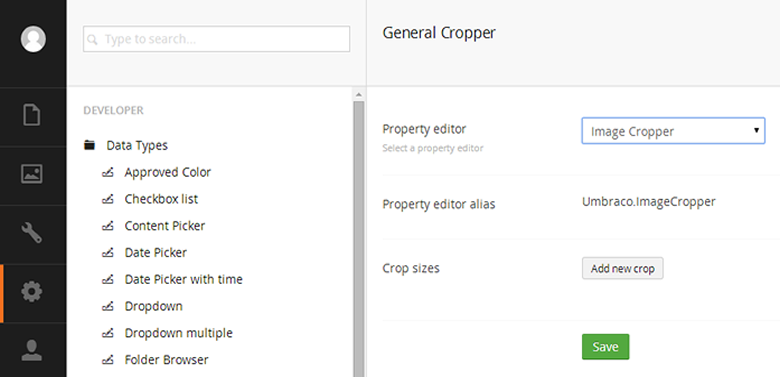
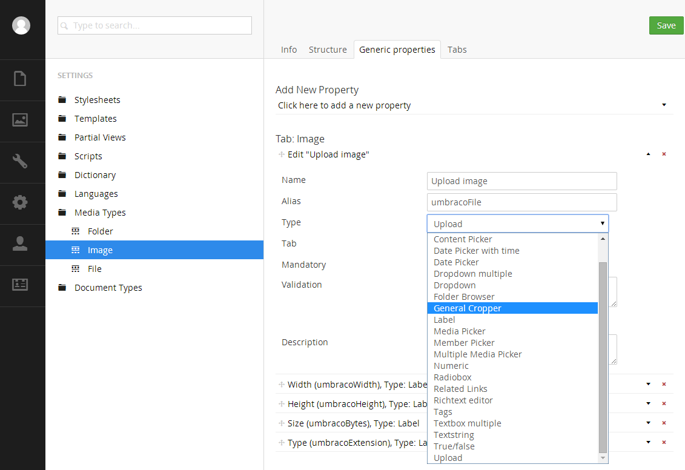
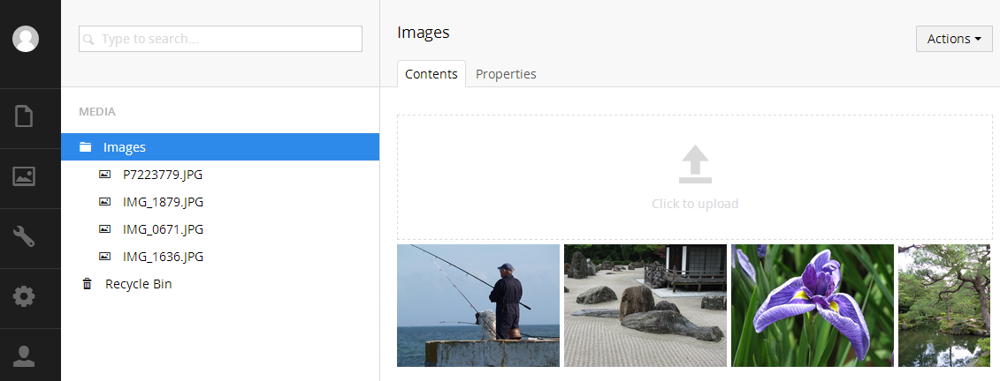
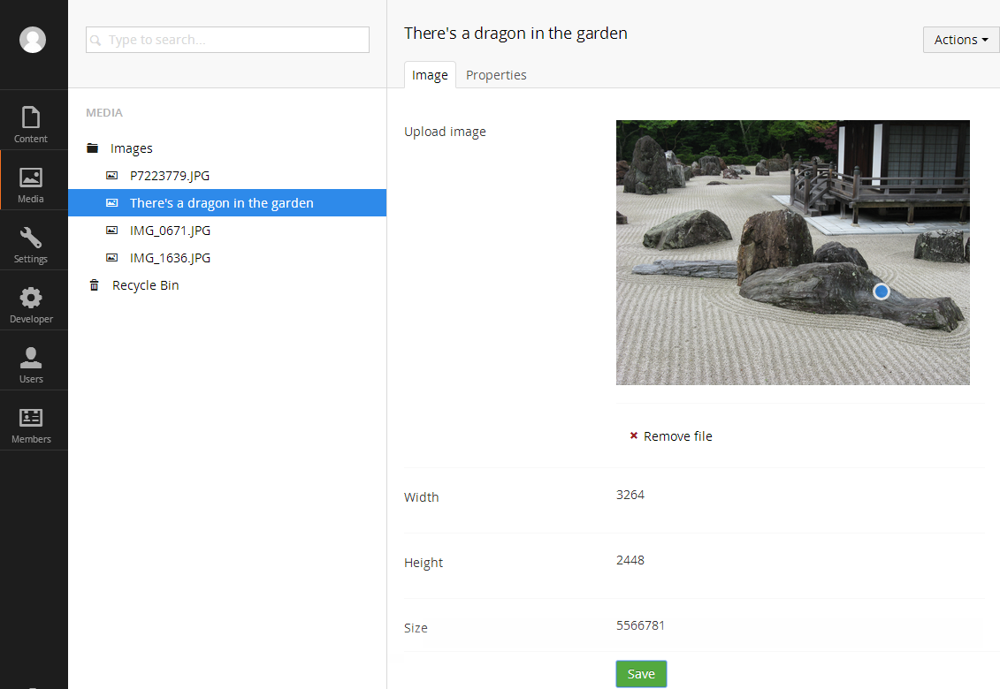
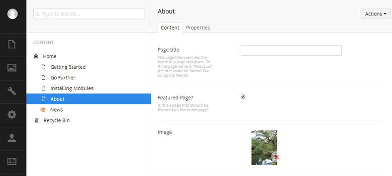
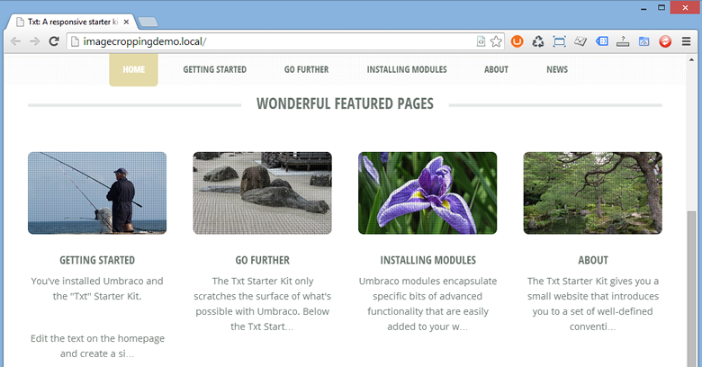
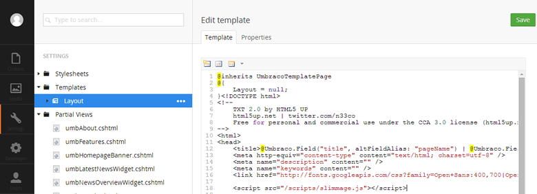
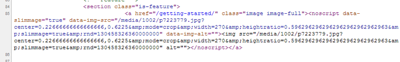
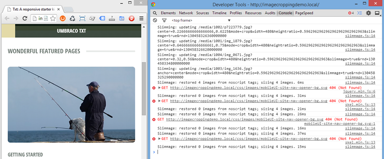

# Developing a website with responsive images using the Umbraco v7.1.4 Image Cropper #

## The requirement: ##

- We want to develop a beautiful responsive website using CSS3 media queries. 
- We would like images at different dimensions to be loaded at different response points. 
- We want the images to look perfect on “retina” displays.
- We want our editors to be able to add images easily and for that image to be reused for different crops throughout our website.

## The approach: ##

- Employ an adaptive imaging technique to load most appropriate image dimensions based on current viewport and device pixel density.
- W3C is working on bringing this feature into HTML vNext with the `<picture>` element. But the `<picture>` element has had an up and down lifespan already and it's still not fully agreed between the interested parties. Current info can be found at [http://www.w3.org/TR/html-picture-element/](http://www.w3.org/TR/html-picture-element/) There is also a very good polyfill for the current specification of the `<picture>` element available at [https://github.com/scottjehl/picturefill](https://github.com/scottjehl/picturefill)
- In the meantime we can use a JavaScript library to achieve the same end game, I am a fan of Slimmage.js because it's designed to easily work with server side image processing and in Umbraco v7.1+ we have just that in ImageProcessor, so lets hook them up.
- Our content editors are going to upload images of various sizes and proportions so we need to use the Umbraco v7.1 Image Cropper to ensure the front end images are in the correct size and proportion. Because the images are going to be reused we will store all images as Media items.

## What is Slimmage.js?  ##

Essentially, it’s a small JS library that when included on a page will alter the width variable in a querystring of a image (e.g. /media/1001/myimage.jpg?width=100) on the client side. 

Slimmage calculates the optimum width based on the current pixel dimensions the image is being displayed at and the pixel density of the device being used. Following the initial load of Slimmage it will recalculate if the window is resized, such as a device changing from portrait to landscape but it will only request a new image if it hasn’t already loaded a larger image. 

Assuming that the server will respect the querystring value (more on that later), this solves two problems: large images are not sent to devices that cannot display lightening the payload, “retina quality” images are served to devices that can display them.

## The solution step by step: ##

Using Umbraco v7.1.4+ with MVC templates

**Step 1:** Configure cropper data type and apply to media. We are not going to use any predefined crops as our images may be used for many different crops throughout the website, our editors will use the interest point (blue dot) to specify the most important element in the image.

 
Figure 1: Creating the image cropper data type

 
Figure 2: Replacing the upload data type with the image cropper on the "Image" media type

**Step 2:** Create a media folder and upload some images and adjust interest point as needed

 
Figure 3: Upload some images

 
Figure 4: Adjusting the interest point on a image

**Step 3:** Using a media picker data type (property alias "Image" in the below example) select the images on the nodes we are going to get images from.

 
Figure 5: Selecting a image for the "About" node

**Step 4:** Add some Razor to our view (template)/partial view to output the required `` element with the correct ImageProcessor Url and specify the required crop dimensions for this view.

		@foreach (var feature in homePage.umbTextPages.Where("featuredPage"))
		{
		    

		        <!-- Feature -->
		        <section class="is-feature">
		            @{
		                if (feature.HasValue("Image"))
		                {
		                    var featureImage = Umbraco.TypedMedia((int)feature.Image);
		                    
		                }
		            }                                                
		            <h3><a href="@feature.Url">@feature.Name</a></h3>
		            @Umbraco.Truncate(feature.BodyText, 100)
		        </section>
		        <!-- /Feature -->
		    

		}
This snippet is using the dynamic CurrentPage model, however we are using a typed media item `TypedMedia` because we want to specify width and height to the `GetCropUrl` extension method and this is not available when using the dynamic `Media` item.

**Step 5:** Test our website, our images should be showing at the correct dimensions. Now lets make them responsive.

 
Figure 6: Our images are cropping to our requested sizes and using the interest points!

**Step 6:** Add Slimmage to our solution. You can download Slimmage.js from GitHub [https://github.com/imazen/slimmage](https://github.com/imazen/slimmage) and copy it into your Scripts folder.  Now we need to add a reference to it in our layout template so it’s included on all pages of our website. Slimmage.js should be the first .js file to be loaded.

 
Figure 7: Added slimmage.js to the layout template

**Step 7:** For Slimmage to work, we need our  tags to be wrapped in `<noscript data-slimmage>` tags. We could do this manually of course, but there is a handy Nuget Package called SlimResponse which takes care of this for us so that we don’t need to do it manually everywhere we want Slimmage. SlimResponse used the HTMLAgilityPack to check `` tags that have “slimmage=true” in their href and then wrap them in the `<noscript>` tag meaning we don’t need to do anything to our HTML markup in our templates.
In Visual Studio (if you don’t use Visual Studio, don’t worry, see Slimsy below) package manager execute: `"Install-Package Imazen.SlimResponse"`

**Step 8:** Adjust the Razor to work with SlimResponse
	
		
We need to add the ratioMode parameter, this will mean that ImageProcessor will resize the height as a ratio of the width, we need this so that our images height is scaled when Slimmage.js alters the width. Additionally we add the furtherOptions parameter with `&slimmage=true` so that SlimResponse will pick up our images and convert them to `<noscript>` tags 

 
Figure 8: Checking for `<noscript>` tags so that we know SlimResponse is working 

**Step 9:** Job done, resize our window small (phone size), reload then and resize window up to see Slimmage adjust the image widths.

 
Figure 9: See Slimmage in action

# Slimsy #

Slimsy is a Umbraco installable package which makes the above approach even easier by installing all of the above packages and files as well as adding some helper methods to simplify the Razor.

Additionally the Slimsy helper methods with with the dynamic `Media` model, so instead of `@Umbraco.TypedMedia` we can use `@Umbraco.Media`

You can download and install Slimsy from [http://our.umbraco.org//projects/website-utilities/slimsy](http://our.umbraco.org//projects/website-utilities/slimsy)